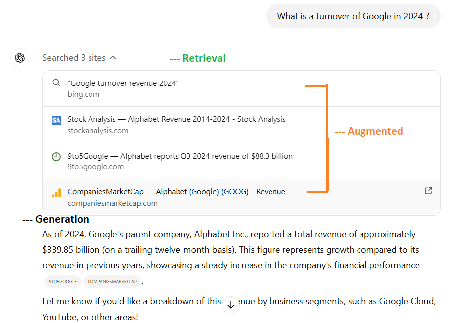
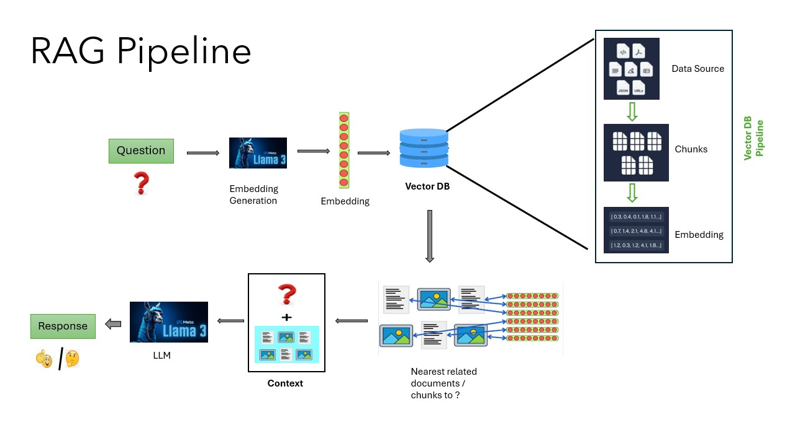

# RAG Pipeline using internal hosted LLM with Ollama

**What is RAG?**

RAG (Retrieval-Augmented Generation) is a machine learning pipeline designed to enhance language model responses by integrating external knowledge sources. It involves retrieving relevant documents or data based on user queries and using that information to generate precise, contextually accurate responses.

<div style="text-align: center;">   
    
</div>

### RAG Pipeline Process:

1. Document Ingestion and Vectorization:

   - Text data (e.g., PDFs, files) is ingested.
   - The data is converted into vector embeddings using a pre-defined embedding model.
   - The vectors are stored in a persistent vector database (like Chroma).
2. Query Understanding:

   - User inputs a query.
   - The query is transformed into an embedding using the same embedding model.
3. Vector Similarity Search:

   - The query embedding is matched against the vector database to retrieve the most relevant documents.
4. Contextual Response Generation:

   - Retrieved documents are passed as context to Ollama.
   - LLM generates a response that integrates the retrieved information with its inherent language understanding.
5. Feedback Loop (Optional):

   - Responses are evaluated for accuracy and relevance, allowing for iterative improvements in document indexing and retrieval.

<div style="text-align: center;">   
    
</div>

# Installation/Setup

```plaintext
POC/RAG_pipeline/
│
├── chroma_db/
|   ├── [db_name]       # That is defined in .env file variable name REVIEWS_CHROMA_PATHS
│
├── data/
│   ├── abc.pdf
│   ├── func_doc/     # Can have a directory 
│   └── ...
│
├── json/
│   ├── games.json    # Expample file to display data store in ChromaDB
│   └── ...
│
├── knowledge_transfer/
│   ├── Chroma.ipynb                # Play around with ChromaDB
│   ├── huggingFace.ipynb           # Get start with HuggingFace
|   ├── PDF_Query_LangChain.ipynb   # Notebook of RAG pipeline
|   ├── methods_emd_generation.py   # Shown 3 methods for embedding generation
|   ├── post_req_int_llm.py         # Post request to internal hosted LLM
│   └── speech.txt                  # Sample data file
├── agent.py                # To create Langchain based agent
├── chat_bot_ui.py
├── chatbot_claimpass.py    # To create claimpass_chain, claimpass_vector_db
├── chatbot.py              # To create sagemaker_chain, games_chain, sagemaker_vector_db, games_vector_db
├── create_database_from_pdf.py
├── int_host_emd.py
├── requirements.txt
├── utils.py
```

To install RAG_pipeline, follow these steps:

1. Clone the repository:

```
git clone https://github.com/Rittika-Mitra/rag-pipeline.git
```

2. Navigate to the project directory:

```
cd rag-pipeline
```

3. Create a virtual environment:

```
conda create -n rag_pipeline python=3.10.15
```

4. Activate a virtual environment:

```
conda activate rag_pipeline
```

5. Install dependencies:

```
pip install -r requirements.txt
```

6. Add the pdf file path or directory address containing pdf files in .env file inside DATA variable 
   and db_name in REVIEWS_CHROMA_PATHS to refer the vector db that have pdf file data.
   Create a `.env` file in the root of your local repo following the tempate [.env_template](./.env_template).

```plaintext
    DATA = ["./data/[xyzabc.pdf]", "[./dir_path]" ]
    REVIEWS_CHROMA_PATHS = ["./chroma_db/[db_name]"]
```

7. Install Ollama from https://github.com/ollama/ollama?tab=readme-ov-file


8. Download the llama3 llm to local

```commandline
ollama pull llama3
```
9. Run:

```
python create_database_from_pdf.py          # will create a Chroma DB for pdf files
```

10. Run:

```
streamlit run chat_bot_ui.py
```

This will launch a locally hosted chatbot application built using Streamlit, accessible via a web browser. Once the command is executed, Streamlit will provide you with a local URL (e.g., http://localhost:8501) where you can interact with the chatbot interface.

# Usage

Some example question that can be asked from LlaMa 3 (internal hosted chatbot) based RAG pipeline

    - Give a monthly AWS ML accounts cost estimation.
    - What is a SageMaker Studio Usage Costs for Compute Instances?

    This will not generate any response as won't find any relevant context for cake making from vector DB
    - What ingredients and methods do I need to bake a chocolate cake?

# Reference

1. https://python.langchain.com/docs/introduction/
2. https://github.com/ollama/ollama
3. https://streamlit.io/
4. https://huggingface.co/docs/inference-endpoints/index
